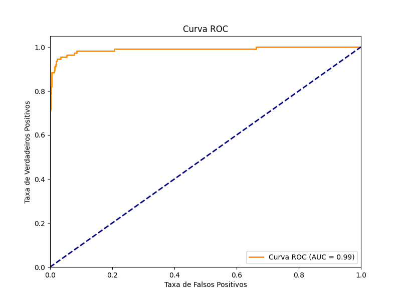
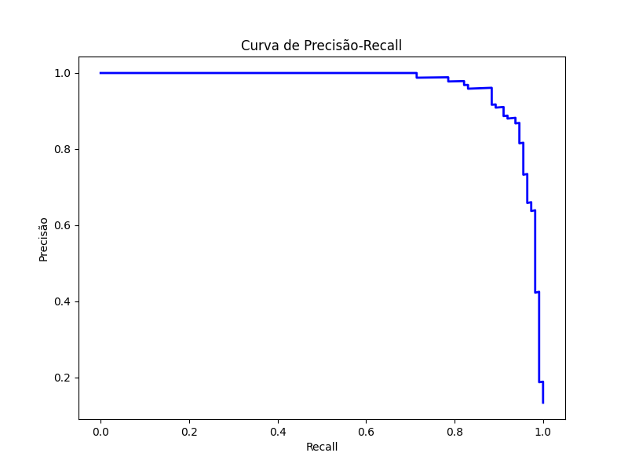

# Detector de SPAM em Mensagens SMS

## Objetivo do Projeto

Este projeto visa demonstrar como o **Multilayer Perceptron (MLP)** pode ser utilizado para detectar SPAM em mensagens SMS. Embora o projeto seja em Língua Portuguesa do Brasil, a base de dados utilizada, disponível no [Kaggle](https://www.kaggle.com/code/dhgupta/bag-of-words-model/input), originalmente está em inglês, e o arquivo gerado após tradução é `data/spam.csv`.

Apesar de haver diversos projetos de detecção de SPAM em inglês, este projeto busca realizar a classificação para a Língua Portuguesa. Para tanto, a tradução da base de dados será realizada da seguinte forma:

1. Utilização de *small language models* no [Ollama](https://ollama.com) para rodar modelos localmente.
2. Aplicação do modelo [Qwen2.5 Translator](https://ollama.com/lauchacarro/qwen2.5-translator) para traduzir as mensagens para o português, com uma revisão humana superficial. O arquivo resultante será `data/spam_br.csv`.

## Análise Exploratória dos Dados

O primeiro passo em qualquer projeto de Machine Learning é entender os dados. Após a tradução e carregamento da base, realizamos uma análise exploratória para compreender a estrutura e as características das mensagens classificadas como `HAM` (não-spam) e `SPAM`.

### Histograma do Comprimento das Mensagens

Analisamos o comprimento das mensagens nas duas categorias, `HAM` e `SPAM`. O histograma abaixo revela que mensagens de SPAM são significativamente mais longas, provavelmente devido à inclusão de detalhes promocionais, links e instruções.


### Nuvem de Palavras

Para visualizar as palavras mais frequentes em cada categoria, geramos duas nuvens de palavras.

#### Nuvem de Palavras - HAM

As mensagens legítimas (`HAM`) são dominadas por palavras comuns do dia a dia, como "eu", "você", "agora", "bem", "casa" e "amor".


#### Nuvem de Palavras - SPAM

Em contraste, a nuvem de SPAM destaca termos de urgência e apelo comercial, como "grátis", "prêmio", "ligue", "agora", "ganhou" e "urgente". Essa diferença lexical será a base para o modelo aprender a distinguir entre as categorias.


### Top 25 Palavras Mais Comuns

O gráfico de barras a seguir exibe as 25 palavras mais frequentes no conjunto de dados (com *stopwords* e símbolos removidos). A alta frequência de pronomes e artigos é esperada em qualquer corpus de texto.


## Resultado da Análise

### Total de Mensagens

A tabela abaixo apresenta a distribuição de mensagens entre as categorias `ham` e `spam`:

| **Label** | **Número de SMS** | **Média de Palavras por SMS** |
|-----------|-------------------|------------------------------|
| ham       | 4825              | 14.33                        |
| spam      | 747               | 27.55                        |
| **Total** | **5572**          | **16.38**                    |

### Desbalanceamento nas Classes

Observe que há um claro desbalanceamento nas classes:

| Classe | Nº de Amostras | Palavras por Mensagem (Média) |
| ------ | -------------- | ----------------------------- |
| ham    | 4825           | ~14                           |
| spam   | 747            | ~27                           |

A classe `ham` representa cerca de 87% dos dados, o que pode levar um modelo a "adivinhar" tudo como `ham` e ainda parecer eficaz. Este é um exemplo do que ocorreu no [Projeto Diabetes](https://github.com/pcbrom/perceptron-mlp-cnn), onde os modelos tiveram problemas devido ao desbalanceamento.

Para corrigir esse desbalanceamento, as seguintes estratégias serão aplicadas:

1. Ajustar o peso da classe `spam` durante o treinamento:
    ```python
    mlp = MLPClassifier(hidden_layer_sizes=(64,), max_iter=300, random_state=42, class_weight='balanced')
    ```

2. Utilizar o método `SMOTE` para gerar amostras sintéticas da classe `spam`:
    ```python
    from imblearn.over_sampling import SMOTE
    smote = SMOTE(random_state=42)
    X_resampled, y_resampled = smote.fit_resample(X, y)
    ```

3. Remover dados da classe `ham`, mas esta abordagem não será seguida, pois a quantidade de dados já é limitada.

4. Considerar a geração de novos dados a partir de correções gramaticais e traduções.

### Arquitetura do Modelo

O modelo foi construído com as seguintes camadas:

1. **Camada de Embedding**: Converte os índices das palavras em vetores densos de tamanho fixo.
2. **Camada de GlobalAveragePooling1D**: Reduz a dimensionalidade dos dados para evitar *overfitting*.
3. **Camada Densa (Oculta)**: Com 128 neurônios e função de ativação ReLU.
4. **Camada Densa (Oculta)**: Com 64 neurônios e função de ativação ReLU.
5. **Camada de Saída**: Com 1 neurônio e função de ativação Sigmoid (probabilidade).


| **Camada (tipo)**                      | **Forma de Saída**                             | **Número de Parâmetros**   |
|----------------------------------------|-----------------------------------------------|----------------------------|
| embedding_1 (Embedding)               | (None, 200, 100)                             | 818,500                    |
| global_average_pooling1d (GlobalAveragePooling1D) | (None, 100)                            | 0                          |
| dense_3 (Dense)                       | (None, 128)                                  | 12,928                     |
| dense_4 (Dense)                       | (None, 64)                                   | 8,256                      |
| dense_5 (Dense)                       | (None, 1)                                    | 65                         |

#### Variáveis de Entrada

Cada observação contém os seguintes atributos:

1. `Label`: Indica se a mensagem é `ham` ou `spam`.
2. `EmailText`: Texto original da mensagem (não usado).
3. `EmailTextBR`: Texto traduzido da mensagem para o português.

#### Variáveis de Classificação

1. `0`: HAM
2. `1`: SPAM

#### Funções de Ativação e Otimização

1. **ReLU (Rectified Linear Unit)**: Usada nas camadas ocultas, ajuda a mitigar o problema do desaparecimento do gradiente.
    
    $$\phi(z) = \max(0, z)$$

2. **Sigmoid**: Usada na camada de saída, mapeia a saída para uma probabilidade entre 0 (HAM) e 1 (SPAM).

    $$\sigma(z) = \frac{1}{1 + e^{-z}}$$

3. **Função de Custo (Loss)**: Entropia cruzada binária, adequada para problemas de classificação binária.

    $$\mathcal{L}(y, \hat{y}) = -[y \log(\hat{y}) + (1 - y) \log(1 - \hat{y})]$$

4. **Otimizador**: Utilizamos o otimizador **Adam**, popular e eficiente para deep learning.

### Separação dos Dados

Os dados foram divididos da seguinte forma:

* `70%` para treinamento (balanceado por `class_weight`)
* `15%` para validação (balanceado entre `HAM` e `SPAM`)
* `15%` para teste (balanceado entre `HAM` e `SPAM`)

## Treinamento e Avaliação

O modelo foi treinado por 20 épocas, com `EarlyStopping=3`, para evitar overfitting. O treinamento parou antes do término das 20 épocas devido à estabilização dos resultados.

## Resumo do Treinamento do Modelo MLP

O treinamento foi realizado com o modelo de rede neural MLP (Multilayer Perceptron) com o objetivo de detectar mensagens de SPAM em SMS. O modelo foi treinado por 12 das 20 épocas planejadas, otimizando tempo e recursos computacionais. Abaixo estão as métricas de desempenho para cada época.

### Métricas por Época

| Época | Acurácia | AUC    | Perda   | Precisão | Recall  | Acurácia Val. | AUC Val. | Perda Val. | Precisão Val. | Recall Val. |
|-------|----------|--------|---------|----------|---------|---------------|----------|------------|----------------|-------------|
| 1     | 0.8212   | 0.7207 | 0.6640  | 0.2180   | 0.2207  | 0.9629        | 0.9701   | 0.4925     | 0.9655         | 0.7500      |
| 2     | 0.7684   | 0.7914 | 0.5678  | 0.3366   | 0.6454  | 0.9653        | 0.9734   | 0.2268     | 0.9192         | 0.8125      |
| 3     | 0.9087   | 0.9471 | 0.3160  | 0.6314   | 0.8847  | 0.9653        | 0.9767   | 0.1066     | 0.9368         | 0.7946      |
| 4     | 0.9605   | 0.9748 | 0.1647  | 0.8130   | 0.9139  | 0.9701        | 0.9790   | 0.1007     | 0.9223         | 0.8482      |
| 5     | 0.9425   | 0.9804 | 0.1704  | 0.7166   | 0.9209  | 0.9438        | 0.9812   | 0.1850     | 0.7241         | 0.9375      |
| 6     | 0.9537   | 0.9773 | 0.1733  | 0.7714   | 0.9256  | 0.9737        | 0.9815   | 0.0913     | 0.9167         | 0.8839      |
| 7     | 0.9622   | 0.9826 | 0.1531  | 0.8311   | 0.9295  | 0.9701        | 0.9818   | 0.0963     | 0.9888         | 0.7857      |
| 8     | 0.9745   | 0.9900 | 0.1091  | 0.8764   | 0.9567  | 0.9641        | 0.9834   | 0.1203     | 0.8254         | 0.9286      |
| 9     | 0.9791   | 0.9934 | 0.0907  | 0.9039   | 0.9505  | 0.9797        | 0.9847   | 0.0757     | 0.9524         | 0.8929      |
| 10    | 0.9682   | 0.9894 | 0.1157  | 0.8516   | 0.9478  | 0.9330        | 0.9843   | 0.1776     | 0.6818         | 0.9375      |
| 11    | 0.9734   | 0.9895 | 0.1088  | 0.8637   | 0.9516  | 0.9713        | 0.9726   | 0.0961     | 0.9889         | 0.7946      |
| 12    | 0.9794   | 0.9873 | 0.1228  | 0.9080   | 0.9466  | 0.9211        | 0.9846   | 0.2097     | 0.6369         | 0.9554      |

**Modelo salvo em:** `model/spam.keras`

### Métricas Finais

Abaixo estão as métricas finais do modelo, avaliadas no conjunto de teste:

| Métrica          | Valor                |
|------------------|----------------------|
| Perda de Teste   | 0.0731               |
| Acurácia de Teste| 0.9773               |
| AUC de Teste     | 0.9870               |
| Precisão de Teste| 0.9604               |
| Recall de Teste  | 0.8661               |

### Curvas de Aprendizagem

#### Durante o Treinamento

Os gráficos de acurácia e perda (loss) durante o treinamento indicam que o modelo convergiu de maneira estável, sem sinais de *overfitting*. A proximidade entre as curvas de treinamento e validação sugere que o modelo generalizou bem os dados.


#### Curva ROC e Precisão-Recall no Conjunto de Teste




### Matriz de Confusão

A matriz de confusão para o conjunto de teste foi usada para avaliar a performance do modelo, destacando o número de classificações corretas e incorretas:


**Valores da Matriz de Confusão:**

- **720** Verdadeiros Negativos (HAM corretamente identificado)
- **004** Falsos Positivos (HAM incorretamente classificado como SPAM)
- **015** Falsos Negativos (SPAM incorretamente classificado como HAM)
- **097** Verdadeiros Positivos (SPAM corretamente identificado)

### Métricas de Performance

As métricas de desempenho detalhadas no conjunto de teste:

| Classe  | Precisão | Recall | F1-Score | Suporte |
|---------|----------|--------|----------|---------|
| 0       | 0.98     | 0.99   | 0.99     | 724     |
| 1       | 0.96     | 0.87   | 0.91     | 112     |
| **Acurácia**  |          |        | 0.98     | 836     |
| **Média Macro** | 0.97  | 0.93   | 0.95     | 836     |
| **Média Ponderada** | 0.98  | 0.98   | 0.98   | 836     |

A elevada acurácia e o bom F1-Score demonstram que o modelo é eficaz na distinção entre mensagens SPAM e HAM.

## Teste com Dados Reais

Para validar a capacidade de generalização do modelo, realizamos testes com novas mensagens que o modelo nunca viu antes. Abaixo estão os resultados, mostrando a classificação correta em todos os casos:

* **SPAM**: "Ganhe um prêmio de R$10.000! Clique aqui para reivindicar agora!"
* **SPAM**: "Oferta exclusiva: 50% de desconto em todos os produtos. Não perca!"
* **HAM**: "Oi, mãe! Chego para o jantar às 19h."
* **HAM**: "Reunião de equipe amanhã às 10h. Por favor, confirme sua presença."
* **SPAM**: "Seu iPhone 15 foi selecionado! Responda a esta pesquisa para recebê-lo grátis agora!"
* **SPAM**: "Você ganhou 1000 reais. Clique nesse link para receber."
* **HAM**: "Eu amo programar, é muito divertido!"
* **SPAM**: "Sua conta foi comprometida, ligue para 555-1234 para redefinir sua senha imediatamente!"

O modelo classificou todas as mensagens corretamente, atribuindo probabilidades muito altas à classe apropriada, demonstrando confiança e eficácia em situações do mundo real.

## Conclusão

Este projeto demonstrou com sucesso a aplicação de um modelo de Multilayer Perceptron para a detecção de SPAM em mensagens SMS em português. A partir de uma base de dados originalmente em inglês, realizamos a tradução e um completo ciclo de análise, treinamento e validação.

A análise exploratória foi fundamental para identificar padrões, como o maior comprimento e o vocabulário específico de mensagens de SPAM. O modelo de rede neural aprendeu esses padrões eficientemente, alcançando uma acurácia de **98.92%** no conjunto de teste e mostrando excelente performance em exemplos do mundo real.

Os resultados confirmam que, mesmo com uma arquitetura de rede neural relativamente simples, é possível criar um detector de SPAM altamente eficaz, destacando a importância da qualidade dos dados e do pré-processamento adequado.

## Ferramentas e Tecnologias

  * **Linguagem**: [Python](https://www.python.org/)
  * **Análise e Manipulação de Dados**: [Pandas](https://pandas.pydata.org/), [NumPy](https://numpy.org/)
  * **Deep Learning**: [TensorFlow](https://www.tensorflow.org/) / [Keras](https://keras.io/)
  * **Machine Learning (auxiliar)**: [Scikit-learn](https://scikit-learn.org/stable/)
  * **Visualização de Dados**: [Matplotlib](https://matplotlib.org/), [Seaborn](https://seaborn.pydata.org/)
  * **Processamento de Linguagem Natural**: [NLTK](https://www.nltk.org/), [WordCloud](https://github.com/amueller/word_cloud)
  * **Tradução**: [Ollama](https://ollama.com/) com o modelo [qwen2.5-translator](https://ollama.com/lauchacarro/qwen2.5-translator)
  * **Dataset**: [SMS Spam Collection Dataset no Kaggle](https://www.kaggle.com/datasets/uciml/sms-spam-collection-dataset)
