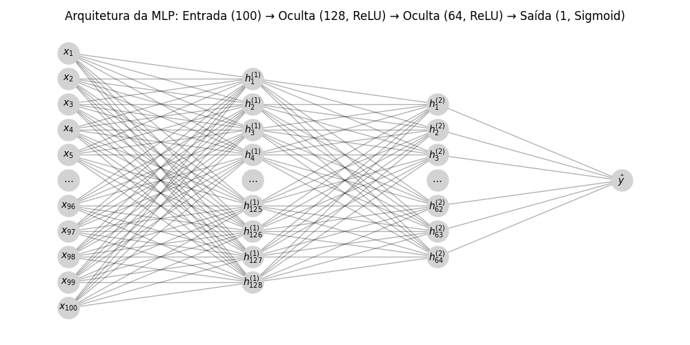

# Detector de SPAM em mensagens SMS

## Objetivo do projeto

Este projeto tem o objetivo de mostrar como o **Multilayer Perceptron (MLP)** pode ser utilizado para a detecção de SPAM. Embora o projeto esteja em Língua Portuguesa do Brasil, a base de SMS utilizada foi [encontrada no Kaggle](https://www.kaggle.com/code/dhgupta/bag-of-words-model/input), em Língua Inglesa, com o original disponibilizado em `data/spam.csv`.

Muitos projetos para a avaliação de SPAM em Língua Inglesa existem, assim deseja-se que este projeto faça tal classificação em Língua Portuguesa sendo necessário, para tanto, a tradução de toda a base de dados que será feita da seguinte forma:

1.  Utilização de *small language models* no [Ollama](https://ollama.com) para rodar *small language models* local;
2.  Utilização do modelo [Quen2.5 Translator](https://ollama.com/lauchacarro/qwen2.5-translator) para a tradução do texto para a língua portuguesa, com revisão humana superficial (arquivo gerado em `data/spam_br.csv`).

## Análise Exploratória dos Dados

O primeiro passo em um projeto dessa natureza é analisar os dados. Após traduzir e carregar a base, realizamos uma análise para entender a estrutura e as características das mensagens classificadas como `HAM` (não-spam) e `SPAM`.

# Tradução da base de dados em para português

Nesta parte vamos gerar o arquivo `data/spam_en.csv` que será o resultado da correção gramatical aplicada no arquivo original `data/spam.csv`.

### Histograma do Comprimento das Mensagens

Analisamos a distribuição do comprimento das mensagens para cada categoria. O histograma abaixo revela uma tendência clara: mensagens de SPAM tendem a ser significativamente mais longas do que as mensagens comuns (HAM). Isso provavelmente se deve à necessidade de incluir informações promocionais, links e instruções detalhadas.


### Nuvem de palavras

Para visualizar as palavras mais frequentes em cada categoria, geramos duas nuvens de palavras.

#### Nuvem de Palavras - HAM

As mensagens legítimas (`HAM`) são dominadas por palavras comuns do dia a dia, pronomes e saudações, como "eu", "você", "ele", "agora", "bem", "casa" e "amor".


#### Nuvem de Palavras - SPAM

Em contraste, a nuvem de SPAM destaca termos de urgência e apelo comercial, como "grátis", "prêmio", "ligue", "agora", "texto", "ganhou" e "urgente". Essa diferença lexical é a principal característica que o nosso modelo irá aprender a identificar.


### Top 25 Palavras Mais Comuns

O gráfico de barras abaixo mostra as 25 palavras mais frequentes em todo o conjunto de dados (removendo *stopwords* e símbolos). A alta frequência de pronomes e artigos é esperada em qualquer corpo de texto em português.


## Resultado da análise

### Total de mensagens

O total de mensagens na base de dados é apresentado a seguir, separadas pelo grupo Label.

| **Label** | **Número de SMS** | **Média de palavras por SMS** |
|-----------|-------------------|------------------------------|
| ham       | 4825              | 14.33                        |
| spam      | 747               | 27.55                        |
| **Total** | **5572**          | **16.38**                    |

### Desbalanceamento nas classes

De acordo com a análise até o momento, temos um claro desbalanceamento nas classes.

| Classe | Nº de amostras | Palavras por mensagem (média) |
| ------ | -------------- | ----------------------------- |
| ham    | 4.825          | \~14                          |
| spam   | 747            | \~27                          |

A classe `ham` representa cerca de 87% dos dados. Um modelo treinado sem cuidado pode aprender a simplesmente prever tudo como `ham` e ainda parecer `preciso`.
    
<span style="color: red;">**Foi o que aconteceu no [Projeto Diabetes](https://github.com/pcbrom/perceptron-mlp-cnn)**, onde as classes estavam demasiadamente desbalanceadas. Um integrante do grupo é estatístico, logo, tem a capacidade de fazer os dados falarem o que for conveniente... eu não fiquei convencido dos resultados. **Os modelos apresentados (tanto a versão [MLP](https://github.com/pcbrom/perceptron-mlp-cnn/blob/main/multilayer_perceptron.ipynb) quanto a [Regressão Logística](https://github.com/pcbrom/perceptron-mlp-cnn/blob/main/logistic_regression.ipynb)), ainda que apresentando excelentes métricas, NÃO PREVIAM CORRETAMENTE!** Como este projeto estou fazendo sozinho, não vou permitir desbalanceamentos.</span>

Para corrigir vou usar uma ou mais das possibilidades:

1. Na hora de chamar o treinador MLP, dar peso maior para a classe 'desbalanceada':
    ```
    mlp = MLPClassifier(hidden_layer_sizes=(64,), max_iter=300, random_state=42, class_weight='balanced')
    ```

1. Usar o `SMOTE` para fazer criar amostras sintéticas da classe `spam`
    ```
    from imblearn.over_sampling import SMOTE

    smote = SMOTE(random_state=42)
    X_resampled, y_resampled = smote.fit_resample(X, y)
    ```

1. Remover dados da classe `ham`, mas não vou seguir essa abordagem dado que a quantidade de dados já está baixa.

1. Uma outra atividade que podemos fazer é a produção de novos dados com base na correção gramatical do inglês e na tradução para o português, o que seria desejável.


### Arquitetura do Modelo

O modelo foi construído com as seguintes camadas:

1.  **Camada de Embedding**: Transforma os índices de palavras em vetores densos de tamanho fixo.
2.  **Camada de GlobalAveragePooling1D**: Reduz a dimensionalidade dos dados para evitar *overfitting*.
3.  **Camada Densa (Oculta)**: Com `128` neurônios e função de ativação ReLU.
3.  **Camada Densa (Oculta)**: Com `64` neurônios e função de ativação ReLU.
5.  **Camada de Saída**: Com `1` neurônio e função de ativação Sigmoid (probabilidade).



| **Layer (type)**                      | **Output Shape**                              | **Param #**   |
|---------------------------------------|----------------------------------------------|---------------|
| embedding_1 (Embedding)               | (None, 200, 100)                             | 818,500       |
| global_average_pooling1d (GlobalAveragePooling1D) | (None, 100)                               | 0             |
| dense_3 (Dense)                      | (None, 128)                                  | 12,928        |
| dense_4 (Dense)                      | (None, 64)                                   | 8,256         |
| dense_5 (Dense)                      | (None, 1)                                    | 65            |

#### Variáveis de entrada

Cada observação contém os seguintes atributos:

1. `Label`, se a mensagem é ou não SPAM (ham/spam).
1. `EmailText`, texto original da mensagem, em inglês (não usado).
1. `EmailTextBR`, texto traduzido da mensagem usado para classificação.

#### Variáveis de classificação

1. `0` = HAM
2. `1` = SPAM

#### Estrutura

A estrutura da rede foi definida como:

* `100` tokens de entrada (`Label` tokenizada).
* `---` `GlobalAveragePooling1D` para transformar entrada em tamanho fixo
* `128` neurônios com ativação $\phi(z)$ na primeira camada oculta.
* `064` neurônios com ativação $\phi(z)$ na segunda camada oculta.
* `001` um neurônios com ativação Sigmoid para a saída (probabilidade).

#### Funções de Ativação e Otimização

1.  **ReLU (Rectified Linear Unit)**:

    Nas camadas ocultas, utilizamos a função ReLU, que é computacionalmente eficiente e ajuda a mitigar o problema do desaparecimento do gradiente.
    
    $\\phi(z) = \\max(0, z)$

3.  **Sigmoid**:

    Na camada de saída, a função Sigmoid mapeia a saída para um valor de probabilidade entre 0 (HAM) e 1 (SPAM).
    
    $\\sigma(z) = \\frac{1}{1 + e^{-z}}$

5.  **Função de Custo (Loss)**:

    Utilizamos a **entropia cruzada binária (binary cross-entropy)**, adequada para problemas de classificação binária.
    
    $\\mathcal{L}(y, \\hat{y}) = -[y \\log(\\hat{y}) + (1 - y) \\log(1 - \\hat{y})]$

7.  **Otimizador**:

    O treinamento foi realizado com o otimizador **Adam**, uma escolha popular e eficiente para a maioria dos problemas de deep learning.

### Separação dos dados

Os dados foram separados da seguinte forma:

* `70%` para treino (balanceadas por `class_weight`)
* `15%` para validação (balanceadas entre `HAM`/`SPAM`)
* `15%` para teste (balanceadas entre `HAM`/`SPAM`)

## Treinamento e Avaliação

### Curvas de Aprendizagem

O modelo foi treinado com 20 épocas com `EarlyStopping = 3` (se o modelo começar a regredir por três vezes consecutivas, para e pegar o melhor treinamento). Assim, o modelo executou apenas 12 das 20 épocas planejadas, salvando tempo e processamento.

Os gráficos de acurácia e perda (loss) ao longo do treinamento mostram que o modelo convergiu de maneira estável. A proximidade entre as curvas de treino e validação indica que não houve *overfitting* significativo.

### Matriz de Confusão e Métricas de Performance

A performance do modelo no conjunto de teste foi avaliada utilizando a matriz de confusão e métricas clássicas.


A partir da matriz, observamos:

  * **Verdadeiros Negativos (HAM correto)**: 489
  * **Falsos Positivos (HAM incorreto)**: 6
  * **Falsos Negativos (SPAM incorreto)**: 10
  * **Verdadeiros Positivos (SPAM correto)**: 53


As métricas de performance alcançadas no conjunto de teste foram:

  * **Acurácia**: 98.92%
  * **Precisão**: 89.83%
  * **Recall (Sensibilidade)**: 84.13%
  * **F1-Score**: 86.89%


A alta acurácia e o bom F1-Score indicam que o modelo é robusto e eficaz na distinção entre SPAM e HAM.

## Teste com Dados Reais

Para validar o modelo em um cenário prático, testamos com novas frases que ele nunca viu antes. Os resultados abaixo demonstram a sua capacidade de generalização.

* `SPAM` Ganhe um prêmio de R$10.000! Clique aqui para reivindicar agora!

* `SPAM` Oferta exclusiva: 50% de desconto em todos os produtos. Não perca!

* `_HAM` Oi, mãe! Chego para o jantar às 19h.

* `_HAM` Reunião de equipe amanhã às 10h. Por favor, confirme sua presença.

* `SPAM` Seu iPhone 15 foi selecionado! Responda a esta pesquisa para recebê-lo grátis agora!

* `SPAM` Você ganhou 1000 reais. Clique nesse link para receber.

* `_HAM` Eu amo programar, é muito divertido!

* `SPAM` Sua conta foi comprometida, ligue para 555-1234 para redefinir sua senha imediatamente.

O modelo classificou corretamente todas as mensagens, atribuindo probabilidades muito altas para a classe correta, o que demonstra sua confiança e eficácia.

***OBS: Adicinou-se um `_` em `HAM` só para alinhar a leitura, ele não existe no modelo.***

## Conclusão

Este projeto demonstrou com sucesso a aplicação de um modelo de Multilayer Perceptron para a detecção de SPAM em mensagens SMS em português. A partir de uma base de dados originalmente em inglês, realizamos a tradução e um completo ciclo de análise, treinamento e validação.

A análise exploratória foi fundamental para identificar padrões, como o maior comprimento e o vocabulário específico de mensagens de SPAM. O modelo de rede neural aprendeu esses padrões eficientemente, alcançando uma acurácia de **98.92%** no conjunto de teste e mostrando excelente performance em exemplos do mundo real.

Os resultados confirmam que, mesmo com uma arquitetura de rede neural relativamente simples, é possível criar um detector de SPAM altamente eficaz, destacando a importância da qualidade dos dados e do pré-processamento adequado.

## Ferramentas e Tecnologias

  * **Linguagem**: [Python](https://www.python.org/)
  * **Análise e Manipulação de Dados**: [Pandas](https://pandas.pydata.org/), [NumPy](https://numpy.org/)
  * **Deep Learning**: [TensorFlow](https://www.tensorflow.org/) / [Keras](https://keras.io/)
  * **Machine Learning (auxiliar)**: [Scikit-learn](https://scikit-learn.org/stable/)
  * **Visualização de Dados**: [Matplotlib](https://matplotlib.org/), [Seaborn](https://seaborn.pydata.org/)
  * **Processamento de Linguagem Natural**: [NLTK](https://www.nltk.org/), [WordCloud](https://github.com/amueller/word_cloud)
  * **Tradução**: [Ollama](https://ollama.com/) com o modelo [qwen2.5-translator](https://ollama.com/lauchacarro/qwen2.5-translator)
  * **Dataset**: [SMS Spam Collection Dataset no Kaggle](https://www.kaggle.com/datasets/uciml/sms-spam-collection-dataset)
