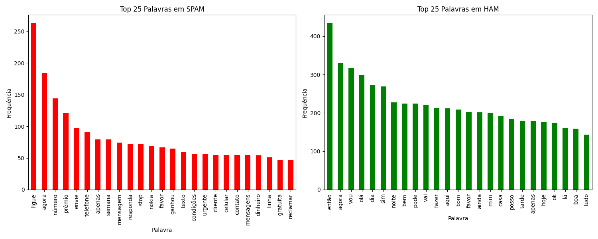

# Detector de SPAM em mensagens SMS

## Objetivo do projeto

Este projeto tem o objetivo de mostrar como o **Multilayer Perceptron** pode ser utilizado para a detecção de SPAM. Embora o projeto esteja em Língua Portuguesa do Brasil, a base de SMS utilizada foi [encontrada no Kaggle](https://www.kaggle.com/code/dhgupta/bag-of-words-model/input), em Língua Inglesa, com o original disponibilizado em `data/spam.csv`.

Muitos projetos para a avaliação de SPAM em Língua Inglesa existem, assim deseja-se que este projeto faça tal classificação em Língua Portuguesa sendo necessário, para tanto, a tradução de toda a base de dados que será feita da seguinte forma:

1. Utilização de *small language models* no [Ollama](https://ollama.com) para rodar *small language models* local;
1. Utilização do modelo [Quen2.5 Translator](https://ollama.com/lauchacarro/qwen2.5-translator) para a tradução do texto para a língua portuguesa, com revisão humana superficial (arquivo gerado em `data/spam_br.csv`).

## Tradução da base de dados em para português

Nesta parte vamos gerar o arquivo `data/spam_en.csv` que será o resultado da correção gramatical aplicada no arquivo original `data/spam.csv`.

## Análise dos dados

O primeiro passo em um projeto dessa natureza é analisar os dados. Para tanto, faremos uma leitura da base original e vamos contar o número palavras e frases. Ao final dessa tarefa, vamos decidir por executar ou não algum pré-processamento.

### Histograma

Podemos ver no histograma que as mensagens de SPAM são muito menores que as HAM na distribuição.


### Nuvem de palavras

Na nuvem de palavras ficará claro que as mensagens de SPAM realmente são aquelas que estamos acostumados a ver, o que indica que a tradução ficou razoável.


### Análise de frequência das palavras

Por fim, procedeu-se com uma análise das 25 palavras mais frequentes em cada tipo de mensagem.



## Resultado da análise

### Total de mensagens

O total de mensagens na base de dados é apresentado a seguir, separadas pelo grupo Label.

| **Label** | **Número de SMS** | **Média de palavras por SMS** |
|-----------|-------------------|------------------------------|
| ham       | 4825              | 14.33                        |
| spam      | 747               | 27.55                        |
| **Total** | **5572**          | **16.38**                    |

### Desbalanceamento nas classes

De acordo com a análise até o momento, temos um claro desbalanceamento nas classes.

| Classe | Nº de amostras | Palavras por mensagem (média) |
| ------ | -------------- | ----------------------------- |
| ham    | 4.825          | \~14                          |
| spam   | 747            | \~27                          |

A classe `ham` representa cerca de 87% dos dados. Um modelo treinado sem cuidado pode aprender a simplesmente prever tudo como `ham` e ainda parecer `preciso`.
    
**Foi o que aconteceu no [Projeto Diabetes](https://github.com/pcbrom/perceptron-mlp-cnn)**, onde as classes estavam demasiadamente desbalanceadas. Um integrante do grupo é estatístico, logo, tem a capacidade de fazer os dados falarem o que for conveniente... eu não fiquei convencido dos resultados. **Os modelos apresentados (tanto a versão [MLP](https://github.com/pcbrom/perceptron-mlp-cnn/blob/main/multilayer_perceptron.ipynb) quanto a [Regressão Logística](https://github.com/pcbrom/perceptron-mlp-cnn/blob/main/logistic_regression.ipynb)), ainda que apresentando excelentes métricas, NÃO PREVIAM CORRETAMENTE!**

Como este projeto estou fazendo sozinho, não vou permitir desbalanceamentos. Para corrigir vou usar uma ou mais das possibilidades:

1. Na hora de chamar o treinador MLP, dar peso maior para a classe 'desbalanceada':
    ```
    mlp = MLPClassifier(hidden_layer_sizes=(64,), max_iter=300, random_state=42, class_weight='balanced')
    ```

1. Usar o `SMOTE` para fazer criar amostras sintéticas da classe `spam`
    ```
    from imblearn.over_sampling import SMOTE

    smote = SMOTE(random_state=42)
    X_resampled, y_resampled = smote.fit_resample(X, y)
    ```

1. Remover dados da classe `ham`, mas não vou seguir essa abordagem dado que a quantidade de dados já está baixa.

1. Uma outra atividade que podemos fazer é a produção de novos dados com base na correção gramatical do inglês e na tradução para o português, o que seria desejável.

## Arquitetura


### Variáveis de entrada

Cada observação contém os seguintes atributos:

1. `Label`, se a mensagem é ou não SPAM (ham/spam).
1. `EmailText`, texto original da mensagem, em inglês (não usado).
1. `EmailText`, texto traduzido da mensagem usado para classificação.

## Variáveis de saída (Target)

1. `0` = HAM
2. `1` = SPAM

## Estrutura

A estrutura da rede foi definida como:

* Entrada: $1$ variáveis de entrada (tokenizada).
* 1ª camada oculta: `5` neurônios com ativação $\phi(z)$.
* 2ª camada oculta: `3` neurônios com ativação $\phi(z)$.
* Camada de saída: `2` neurônios com ativação Softmax.

### Funções de Ativação

1. ReLU

    Nas **camadas ocultas**, utilizamos a função Rectified Linear Unit (**ReLU**):
    $$
    \phi(z) = \max(0, z),
    $$
    computacionalmente eficiente e ajuda a evitar o problema de saturação presente em funções como a sigmoide.

1. Softmax
    Na **camada de saída**, utilizamos a função **Softmax**:
    $$
    \text{softmax}(z_j) = \frac{e^{z_j}}{\sum_{k} e^{z_k}}
    $$

1. Custo

    Como a saída está codificada em **one-hot**, adotamos a **cross-entropy categórica** como função de custo:
    $$
    \mathcal{L}(y, \hat{y}) = - \frac{1}{n} \sum_{i=1}^n \sum_{j=1}^{2} y_{ij} \log(\hat{y}_{ij})
    $$

1. Otimização

    O treinamento foi realizado utilizando o algoritmo de **descida do gradiente clássica (batch)**:

    * Os gradientes foram computados por meio do algoritmo de **backpropagation**. Os pesos foram atualizados de forma simultânea com base no erro de todo o conjunto de treino, com taxa de aprendizado $\eta$.

### Separação dos dados

Os dados foram separados da seguinte forma:

* Treino = 80%
* Validação = 10%
* Teste = 10%

Para a validação e teste vamos observar o balanceamento das classes, sendo 5% de HAM/SPAM para cada.

### Avaliação

Durante o treinamento, monitorou-se:

* A **função de perda** (cross-entropy) em treino e validação.
* A **acurácia** em ambos os conjuntos.

Após o treinamento, o modelo foi avaliado no **conjunto de teste** por meio de matriz de confusão apresentando métricas de acurácia, precisão, recall e $F_1$-score.