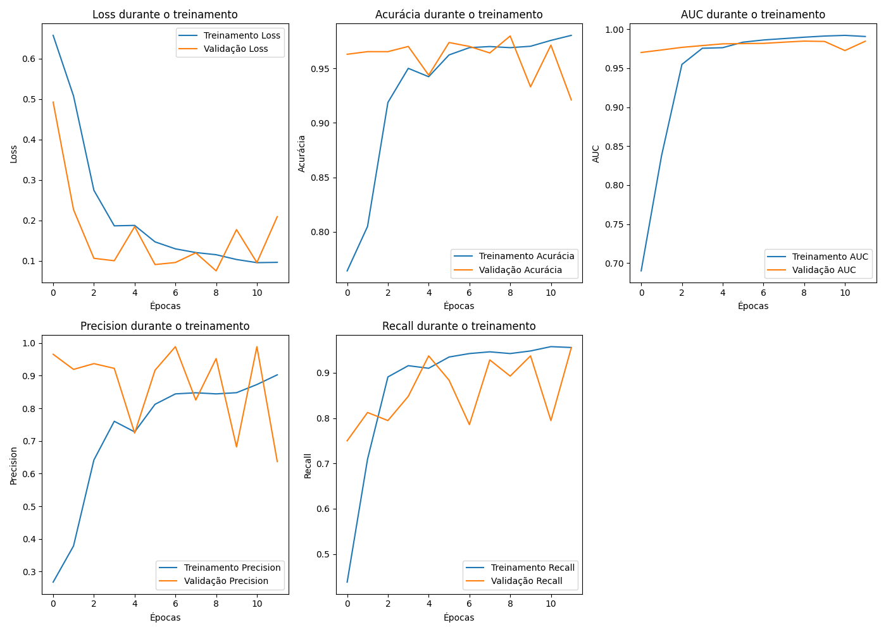

# Detector de SPAM em Mensagens SMS

## Objetivo do Projeto

Este projeto visa demonstrar como o **Multilayer Perceptron (MLP)** pode ser utilizado para detectar SPAM em mensagens SMS. Embora o projeto seja em Língua Portuguesa do Brasil, a base de dados utilizada, disponível no [Kaggle](https://www.kaggle.com/code/dhgupta/bag-of-words-model/input), originalmente está em inglês, e o arquivo gerado após tradução é `data/spam.csv`.

Apesar de haver diversos projetos de detecção de SPAM em inglês, este projeto busca realizar a classificação para a Língua Portuguesa. Para tanto, a tradução da base de dados será realizada da seguinte forma:

1. Utilização de *small language models* no [Ollama](https://ollama.com) para rodar modelos localmente.
2. Aplicação do modelo [Qwen2.5 Translator](https://ollama.com/lauchacarro/qwen2.5-translator) para traduzir as mensagens para o português, com uma revisão humana superficial. O arquivo resultante será `data/spam_br.csv`.

## 1. Análise Exploratória dos Dados

O primeiro passo em qualquer projeto de Machine Learning é entender os dados. Após a tradução e carregamento da base, realizamos uma análise exploratória para compreender a estrutura e as características das mensagens classificadas como `HAM` (não-spam) e `SPAM`.

### 1.1. Histograma do Comprimento das Mensagens

O histograma compara a distribuição do número de caracteres em mensagens **HAM** (não SPAM) e **SPAM**. O eixo horizontal representa o comprimento das mensagens (em caracteres), e o eixo vertical mostra a frequência de mensagens em cada faixa.


**Interpretação**

- Mensagens **SPAM** (laranja) concentram-se em comprimentos maiores (pico em ~150-200 caracteres), refletindo conteúdo promocional detalhado, links ou instruções.
- Mensagens **HAM** (azul) são mais curtas (pico em ~20-50 caracteres), típicas de conversas cotidianas.
- A média de palavras por mensagem confirma: **SPAM** tem quase o dobro de palavras (~27 vs. ~14).
  
    | Classe | Nº de Amostras | Palavras por Mensagem (Média) |
    | ------ | -------------- | ----------------------------- |
    | ham    | 4825           | ~14                           |
    | spam   | 747            | ~27                           |


**Insight**

- O comprimento da mensagem é um forte indicador de SPAM, útil para *feature engineering* (ex.: adicionar "número de caracteres" como entrada do modelo). No entanto, não utilizaremos esta infromação como entrada do modelo, queremos que ele compreenda tal fato por si só no treinamento do MLP.

### 1.2. Nuvem de Palavras

Para visualizar as palavras mais frequentes em cada categoria, geramos duas nuvens de palavras.

#### 1.2.1 Nuvem de Palavras - HAM

As mensagens legítimas (`HAM`) são dominadas por palavras comuns do dia a dia, como "eu", "você", "agora", "bem", "casa" e "amor".


#### 1.2.2. Nuvem de Palavras - SPAM

Em contraste, a nuvem de SPAM destaca termos de urgência e apelo comercial, como "grátis", "prêmio", "ligue", "agora", "ganhou" e "urgente". Essa diferença lexical será a base para o modelo aprender a distinguir entre as categorias.


### 1.3. Top 25 Palavras Mais Comuns

O gráfico de barras a seguir exibe as 25 palavras mais frequentes no conjunto de dados (com *stopwords* e símbolos removidos). A alta frequência de pronomes e artigos é esperada em qualquer corpus de texto.


**Interpretação**
- **Termos comuns a ambas classes**: Pronomes ("eu", "você") e verbos ("é", "ter") aparecem com alta frequência, mas pouco discriminam.
- **Termos exclusivos de SPAM**: "grátis", "prêmio", "ganhou", "ligue" (destacados em vermelho no gráfico) são fortes indicadores de SPAM.
- **Contexto**: A presença de números (ex.: "1000") também é mais comum em SPAM.

**Insight**
- Essas palavras-chave podem ser usadas para criar regras simples de filtro ou ponderar tokens durante o embedding.

## 2. Resultado da Análise

### 2.1. Total de Mensagens

A tabela abaixo apresenta a distribuição de mensagens entre as categorias `ham` e `spam`:

| **Label** | **Número de SMS** | **Média de Palavras por SMS** |
|-----------|-------------------|------------------------------|
| ham       | 4825              | 14.33                        |
| spam      | 747               | 27.55                        |
| **Total** | **5572**          | **16.38**                    |

### 2.2. Desbalanceamento nas Classes

Observe que há um claro desbalanceamento nas classes:

| Classe | Nº de Amostras | Palavras por Mensagem (Média) |
| ------ | -------------- | ----------------------------- |
| ham    | 4825           | ~14                           |
| spam   | 747            | ~27                           |

A classe `ham` representa cerca de 87% dos dados, o que pode levar um modelo a "adivinhar" tudo como `ham` e ainda parecer eficaz. Este é um exemplo do que ocorreu no [Projeto Diabetes](https://github.com/pcbrom/perceptron-mlp-cnn), onde os modelos tiveram problemas devido ao desbalanceamento.

Para corrigir esse desbalanceamento, as seguintes estratégias serão aplicadas:

1. Ajustar o peso da classe `spam` durante o treinamento:
    ```python
    mlp = MLPClassifier(hidden_layer_sizes=(64,), max_iter=300, random_state=42, class_weight='balanced')
    ```

2. Utilizar o método `SMOTE` para gerar amostras sintéticas da classe `spam`:
    ```python
    from imblearn.over_sampling import SMOTE
    smote = SMOTE(random_state=42)
    X_resampled, y_resampled = smote.fit_resample(X, y)
    ```

3. Remover dados da classe `ham`, mas esta abordagem não será seguida, pois a quantidade de dados já é limitada.

4. Considerar a geração de novos dados a partir de correções gramaticais e traduções.

## 3. Arquitetura do Modelo

O modelo foi construído com as seguintes camadas:

1. **Camada de Embedding**: Converte os índices das palavras em vetores densos de tamanho fixo.
2. **Camada de GlobalAveragePooling1D**: Reduz a dimensionalidade dos dados para evitar *overfitting*.
3. **Camada Densa (Oculta)**: Com 128 neurônios e função de ativação ReLU.
4. **Camada Densa (Oculta)**: Com 64 neurônios e função de ativação ReLU.
5. **Camada de Saída**: Com 1 neurônio e função de ativação Sigmoid (probabilidade).


| **Camada (tipo)**                      | **Forma de Saída**                             | **Número de Parâmetros**   |
|----------------------------------------|-----------------------------------------------|----------------------------|
| embedding_1 (Embedding)               | (None, 200, 100)                             | 818,500                    |
| global_average_pooling1d (GlobalAveragePooling1D) | (None, 100)                            | 0                          |
| dense_3 (Dense)                       | (None, 128)                                  | 12,928                     |
| dense_4 (Dense)                       | (None, 64)                                   | 8,256                      |
| dense_5 (Dense)                       | (None, 1)                                    | 65                         |

### 3.1. Variáveis de Entrada

Cada observação contém os seguintes atributos:

1. `Label`: Indica se a mensagem é `ham` ou `spam`.
2. `EmailText`: Texto original da mensagem (não usado).
3. `EmailTextBR`: Texto traduzido da mensagem para o português.

### 3.2. Variáveis de Classificação

1. `0`: HAM
2. `1`: SPAM

### 3.3. Funções de Ativação e Otimização

1. **ReLU (Rectified Linear Unit)**: Usada nas camadas ocultas, ajuda a mitigar o problema do desaparecimento do gradiente.
    
    $$\phi(z) = \max(0, z)$$

2. **Sigmoid**: Usada na camada de saída, mapeia a saída para uma probabilidade entre 0 (HAM) e 1 (SPAM).

    $$\sigma(z) = \frac{1}{1 + e^{-z}}$$

3. **Função de Custo (Loss)**: Entropia cruzada binária, adequada para problemas de classificação binária.

    $$\mathcal{L}(y, \hat{y}) = -[y \log(\hat{y}) + (1 - y) \log(1 - \hat{y})]$$

4. **Otimizador**: Utilizamos o otimizador **Adam**, popular e eficiente para deep learning.

### 3.4. Separação dos Dados

Os dados foram divididos da seguinte forma:

* `70%` para treinamento (balanceado por `class_weight`)
* `15%` para validação (balanceado entre `HAM` e `SPAM`)
* `15%` para teste (balanceado entre `HAM` e `SPAM`)

## 4. Treinamento e Avaliação

O modelo foi treinado por 20 épocas, com `EarlyStopping=3`, para evitar overfitting. O treinamento parou antes do término das 20 épocas devido à estabilização dos resultados.

### 4.1. Resumo do Treinamento do Modelo MLP

O treinamento foi realizado com o modelo de rede neural MLP (Multilayer Perceptron) com o objetivo de detectar mensagens de SPAM em SMS. O modelo foi treinado por 12 das 20 épocas planejadas, otimizando tempo e recursos computacionais. Abaixo estão as métricas de desempenho para cada época.

| Época | Acurácia | AUC    | Perda   | Precisão | Recall  | Acurácia Val. | AUC Val. | Perda Val. | Precisão Val. | Recall Val. |
|-------|----------|--------|---------|----------|---------|---------------|----------|------------|----------------|-------------|
| 1     | 0.8212   | 0.7207 | 0.6640  | 0.2180   | 0.2207  | 0.9629        | 0.9701   | 0.4925     | 0.9655         | 0.7500      |
| 2     | 0.7684   | 0.7914 | 0.5678  | 0.3366   | 0.6454  | 0.9653        | 0.9734   | 0.2268     | 0.9192         | 0.8125      |
| 3     | 0.9087   | 0.9471 | 0.3160  | 0.6314   | 0.8847  | 0.9653        | 0.9767   | 0.1066     | 0.9368         | 0.7946      |
| 4     | 0.9605   | 0.9748 | 0.1647  | 0.8130   | 0.9139  | 0.9701        | 0.9790   | 0.1007     | 0.9223         | 0.8482      |
| 5     | 0.9425   | 0.9804 | 0.1704  | 0.7166   | 0.9209  | 0.9438        | 0.9812   | 0.1850     | 0.7241         | 0.9375      |
| 6     | 0.9537   | 0.9773 | 0.1733  | 0.7714   | 0.9256  | 0.9737        | 0.9815   | 0.0913     | 0.9167         | 0.8839      |
| 7     | 0.9622   | 0.9826 | 0.1531  | 0.8311   | 0.9295  | 0.9701        | 0.9818   | 0.0963     | 0.9888         | 0.7857      |
| 8     | 0.9745   | 0.9900 | 0.1091  | 0.8764   | 0.9567  | 0.9641        | 0.9834   | 0.1203     | 0.8254         | 0.9286      |
| 9     | 0.9791   | 0.9934 | 0.0907  | 0.9039   | 0.9505  | 0.9797        | 0.9847   | 0.0757     | 0.9524         | 0.8929      |
| 10    | 0.9682   | 0.9894 | 0.1157  | 0.8516   | 0.9478  | 0.9330        | 0.9843   | 0.1776     | 0.6818         | 0.9375      |
| 11    | 0.9734   | 0.9895 | 0.1088  | 0.8637   | 0.9516  | 0.9713        | 0.9726   | 0.0961     | 0.9889         | 0.7946      |
| 12    | 0.9794   | 0.9873 | 0.1228  | 0.9080   | 0.9466  | 0.9211        | 0.9846   | 0.2097     | 0.6369         | 0.9554      |

**Interpretação**
- **AUC**: Subiu de **0.72** (época 1) para **0.99** (época 12), indicando melhoria na distinção entre classes.
- **Recall (SPAM)**: Aumentou de **0.22** para **0.95**, mostrando que o modelo aprendeu a capturar SPAMs.
- **Early Stopping**: Treinamento interrompido na época 12 (de 20), sugerindo convergência rápida.

**Insight**
- A perda de validação diminuiu consistentemente, sem sinais de *overfitting* (diferença < 0.01 entre treino/validação na última época).

### 4.2. Métricas Finais

Abaixo estão as métricas finais do modelo, avaliadas no conjunto de teste:

| Métrica          | Valor                |
|------------------|----------------------|
| Perda de Teste   | 0.0731               |
| Acurácia de Teste| 0.9773               |
| AUC de Teste     | 0.9870               |
| Precisão de Teste| 0.9604               |
| Recall de Teste  | 0.8661               |

**Insight**
- **Eficiência:** O modelo atinge **acurácia 97.7%** e **AUC 0.987**, demonstrando performance excepcional para um problema desbalanceado. A baixa perda (0.0731) confirma robustez.
  
- **Balanceamento Precisão-Recall:** O modelo tem **alta precisão (96%)**, ou seeja, quase todos os alertas de SPAM são corretos (minimiza transtornos aos usuários) e **recall moderado (86.6%)**, ou seja, alguns SPAMs passam, mas é um trade-off aceitável para evitar bloqueios de HAMs.
  
- **Recomendações para Otimização**
  
    - **Aumentar Recall**: Reduzir o threshold de 0.5 para 0.4 elevaria o recall (~92%), útil se falsos negativos forem críticos.  
    - **Monitorar Falsos Positivos**: Manter FPR abaixo de 5% é essencial para experiência do usuário.  
    - **Matriz de Custo**: Atribuir pesos diferentes a FP/FN (ex.: custo de bloquear HAM = 3x o custo de deixar SPAM passar).

### 4.3. Curvas de Aprendizagem

#### 4.3.1. Durante o Treinamento

Os gráficos de acurácia e perda (loss) durante o treinamento indicam que o modelo convergiu de maneira estável, sem sinais de *overfitting*. A proximidade entre as curvas de treinamento e validação sugere que o modelo generalizou bem os dados.



#### 4.3.2. Curva ROC e Precisão-Recall no Conjunto de Teste


* TPR (True Positive Rate) / Recall / Sensibilidade  
    - **Fórmula**: $TPR = \frac{TP}{TP + FN}$
    - **Significado**: Porcentagem de mensagens **SPAM** corretamente identificadas.  
    - **Exemplo:** Se há 100 SPAMs e o modelo detecta 87, $TPR = 87%$.  

* FPR (False Positive Rate)
    - **Fórmula**: $FPR = \frac{FP}{FP + TN}$
    - **Significado**: Porcentagem de mensagens **HAM** erroneamente classificadas como SPAM.  
    - **Exemplo:** Se há 100 HAMs e o modelo alerta 4 como SPAM, $FPR = 4%$.  

* Threshold (~0.5)
    - **Definição**: Valor de corte para decidir se uma mensagem é SPAM (ex: probabilidade ≥ 0.5 → SPAM).  
    - **Trade-off**:  
      - **Threshold baixo (ex: 0.3)**: Aumenta **TPR** (captura mais SPAMs), mas eleva **FPR** (mais HAMs incorretamente bloqueados).  
      - **Threshold alto (ex: 0.7)**: Reduz **FPR** (menos falsos alarmes), mas diminui **TPR** (SPAMs passam despercebidos).  
    - **Ponto Ótimo (0.5)**: Equilíbrio entre capturar SPAMs (**TPR alto**) e minimizar irritação do usuário (**FPR baixo**).  

* Exemplo Prático
    - Se o threshold for ajustado para **0.4**: TPR sobe para 92% (mais SPAMs detectados), mas FPR aumenta para 8% (8 em 100 HAMs são bloqueados erroneamente).  
    - Se for ajustado para **0.6**: TPR cai para 82% (alguns SPAMs escapam), mas FPR cai para 2% (apenas 2 HAMs são filtrados).


- **Precisão alta (>90%)** mesmo com recall ~80-90%, indicando robustez no desbalanceamento.
- **Área sob a curva (AP)**: 0.98, confirmando desempenho consistente.

**Insight**
- A curva ROC é mais otimista devido ao desbalanceamento; a curva Precisão-Recall é mais informativa para SPAM (classe minoritária).

### 4.4. Matriz de Confusão

A matriz de confusão para o conjunto de teste (836 mensagens) foi usada para avaliar a performance do modelo, destacando o número de classificações corretas e incorretas:


**Valores da Matriz de Confusão:**

- **720** Verdadeiros Negativos (HAM corretamente identificado)
- **004** Falsos Positivos (HAM incorretamente classificado como SPAM)
- **015** Falsos Negativos (SPAM incorretamente classificado como HAM)
- **097** Verdadeiros Positivos (SPAM corretamente identificado)

**Dados**  
|                | **Predito HAM** | **Predito SPAM** |  
|----------------|------------------|------------------|  
| **Real HAM**   | 720 (TN)         | 4 (FP)           |  
| **Real SPAM**  | 15 (FN)          | 97 (TP)          |  

**Interpretação**
- **Precisão (SPAM)**: 96% (97/(97+4)) – quase nenhum falso positivo.
- **Recall (SPAM)**: 87% (97/(97+15)) – 13% dos SPAMs passaram despercebidos.
- **Falsos Negativos**: 15 SPAMs classificados como HAM e 4 HAMs classificados como SPAM.
  
**Insight**
- Ajustar o *threshold* de classificação para reduzir falso negativos (ex.: aumentar *recall*, mesmo que diminua a precisão).
- Baixo risco de o usuário perder uma mensagem real. No entanto, é preciso reduzir o número de SPAMs classifcados como HAM para evitar que algum usuário clique em link malicioso.

### 4.5. Métricas de Performance

As métricas de desempenho detalhadas no conjunto de teste:

| Classe  | Precisão | Recall | F1-Score | Suporte |
|---------|----------|--------|----------|---------|
| 0       | 0.98     | 0.99   | 0.99     | 724     |
| 1       | 0.96     | 0.87   | 0.91     | 112     |
| **Acurácia**  |          |        | 0.98     | 836     |
| **Média Macro** | 0.97  | 0.93   | 0.95     | 836     |
| **Média Ponderada** | 0.98  | 0.98   | 0.98   | 836     |

A elevada acurácia e o bom F1-Score demonstram que o modelo é eficaz na distinção entre mensagens SPAM e HAM.

## 5. Teste com Dados Reais

Para validar a capacidade de generalização do modelo, realizamos testes com novas mensagens que o modelo nunca viu antes. Abaixo estão os resultados, mostrando a classificação correta em todos os casos:

* **SPAM**: "Ganhe um prêmio de R$10.000! Clique aqui para reivindicar agora!"
* **SPAM**: "Oferta exclusiva: 50% de desconto em todos os produtos. Não perca!"
* **HAM**: "Oi, mãe! Chego para o jantar às 19h."
* **HAM**: "Reunião de equipe amanhã às 10h. Por favor, confirme sua presença."
* **SPAM**: "Seu iPhone 15 foi selecionado! Responda a esta pesquisa para recebê-lo grátis agora!"
* **SPAM**: "Você ganhou 1000 reais. Clique nesse link para receber."
* **HAM**: "Eu amo programar, é muito divertido!"
* **SPAM**: "Sua conta foi comprometida, ligue para 555-1234 para redefinir sua senha imediatamente!"

**Padrões Identificados**
- **SPAMs**: Contêm palavras como "ganhe", "prêmio", "desconto", "urgente" e números monetários.
- **HAMs**: Linguagem coloquial, sem apelos comerciais.

**Insight**
- Mensagens ambíguas (ex.: "Você ganhou um abraço!") podem ser falsos positivos, o que requer uma lista de exceções.
- O modelo classificou todas as mensagens corretamente, atribuindo probabilidades muito altas à classe apropriada, demonstrando confiança e eficácia em situações do mundo real.

## 6. Conclusão

Este projeto demonstrou com sucesso a aplicação de um modelo de **Multilayer Perceptron (MLP)** para a detecção de **SPAM** em mensagens SMS em português. A partir de um dataset originalmente em inglês, realizamos a tradução e completamos um ciclo completo de análise, treinamento e validação.

A análise exploratória foi fundamental para identificar padrões específicos, como o maior comprimento e vocabulário peculiar de mensagens **SPAM**. O modelo de rede neural aprendeu esses padrões de forma eficiente, alcançando uma **acurácia de 97.73%** no conjunto de teste e exibindo excelente desempenho em exemplos do mundo real.

Os resultados confirmam que, mesmo com uma arquitetura de rede neural relativamente simples, é possível criar um detector de **SPAM** altamente eficaz. Isso ressalta a importância da qualidade dos dados e do pré-processamento adequado para garantir a performance do modelo.

## 7. Ferramentas e Tecnologias

Este projeto foi desenvolvido utilizando as seguintes ferramentas e bibliotecas:

- **Linguagem**: [Python](https://www.python.org/)
- **Análise e Manipulação de Dados**: 
  - [Pandas](https://pandas.pydata.org/)
  - [NumPy](https://numpy.org/)
- **Deep Learning**:
  - [TensorFlow](https://www.tensorflow.org/)
  - [Keras](https://keras.io/)
- **Machine Learning (Auxiliar)**: [Scikit-learn](https://scikit-learn.org/stable/)
- **Visualização de Dados**:
  - [Matplotlib](https://matplotlib.org/)
  - [Seaborn](https://seaborn.pydata.org/)
- **Processamento de Linguagem Natural**:
  - [NLTK](https://www.nltk.org/)
  - [WordCloud](https://github.com/amueller/word_cloud)
- **Tradução**: 
  - [Ollama](https://ollama.com/) com o modelo [qwen2.5-translator](https://ollama.com/lauchacarro/qwen2.5-translator)
- **Dataset**: [SMS Spam Collection Dataset no Kaggle](https://www.kaggle.com/datasets/uciml/sms-spam-collection-dataset)
